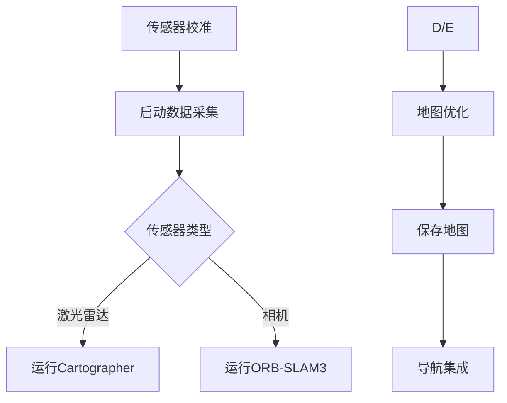

# 基于激光的SLAM与视觉SLAM比较及ROS实现指南

## 一、激光SLAM与视觉SLAM对比

| **特性**       | **激光SLAM**                 | **视觉SLAM**                    |
| -------------- | ---------------------------- | ------------------------------- |
| **传感器**     | 激光雷达（LiDAR）            | 单目/双目/RGB-D相机             |
| **精度**       | 高精度（厘米级）             | 中等精度（依赖特征匹配）        |
| **环境适应性** | 受光照影响小，适应黑暗环境   | 依赖光照条件，动态物体敏感      |
| **计算资源**   | 中等（点云处理）             | 较高（图像特征提取/优化）       |
| **建图效果**   | 高精度2D/3D几何地图          | 稀疏/半稠密语义地图             |
| **典型算法**   | Gmapping, Cartographer, LOAM | ORB-SLAM, LSD-SLAM, VINS-Fusion |
| **应用场景**   | 室内导航、自动驾驶           | AR/VR、无人机、消费级机器人     |

---

## 二、算法选择建议

### 可以优先选择激光SLAM的场景：
1. *需要高精度几何地图的工业场景*
2. 光照条件复杂/黑暗环境
3. 实时性要求高的自动驾驶场景

### 可以优先选择视觉SLAM的场景：
1. 成本敏感的消费级产品
2. 需要语义理解的场景（如AR导航）
3. 重量/尺寸受限的移动平台（如无人机）

### 推荐方案：
```python
if 环境光照稳定且需要语义信息:
    选择VINS-Fusion或ORB-SLAM3
elif 高精度导航且预算充足:
    选择LIO-SAM（激光惯性融合方案）
else:
    采用Cartographer（激光+IMU多传感器融合）
```

## 三、ROS实现流程

### 激光SLAM实现（以Cartographer为例）

```bash
# 安装依赖
sudo apt-get install ros-$ROS_DISTRO-cartographer-ros

# 创建launch文件
mkdir -p ~/catkin_ws/src/cartographer_ros/cartographer_ros/launch
# 配置demo_2d.launch（需修改雷达话题名称）

# 运行SLAM
roslaunch cartographer_ros demo_2d.launch

# 保存地图
rosrun map_server map_saver -f ~/map

```

### 视觉SLAM实现（以ORB-SLAM3为例）

```bash
# 安装依赖
sudo apt install libopencv-dev libeigen3-dev libpangolin-dev

# 编译ORB-SLAM3
cd ~/catkin_ws/src
git clone https://github.com/UZ-SLAMLab/ORB_SLAM3.git
cd ORB_SLAM3 && chmod +x build.sh && ./build.sh

# 创建ROS节点
catkin_create_pkg orb_slam3_ros roscpp std_msgs image_transport

# 运行示例（需准备校准参数文件）
rosrun ORB_SLAM3 Mono Vocabulary/ORBvoc.txt Examples/Monocular/EuRoC.yaml

```

## 四、融合方案的一些想法

### 多模态场景

```xml
<!-- 在launch文件中配置多传感器 -->
<node pkg="robot_localization" type="ekf_localization_node" name="ekf_se">
  <rosparam command="load" file="$(find robot_localization)/params/dual_ekf_navsat_example.yaml"/>
</node>

<!-- 配置传感器数据同步 -->
<node pkg="message_filters" type="approximate_time" name="sensor_sync">
  <param name="queue_size" value="10"/>
</node>

```

## 五、性能优化技巧

### 激光SLAM优化

- 使用IMU进行运动补偿
- 调整体素滤波参数（leaf_size=0.1）
- 启用多分辨率地图

### 视觉SLAM优化

- 使用GPU加速特征提取
- 配置动态特征剔除阈值
- 启用回环检测线程

## 六、AI评估指标对比

| **指标**  | 激光SLAM典型值 | 视觉SLAM典型值 |
| --------- | -------------- | -------------- |
| 定位误差  | 0.1-0.3m       | 0.5-2.0m       |
| 建图频率  | 10-20Hz        | 5-15Hz         |
| CPU占用率 | 30-50%         | 50-80%         |
| 内存消耗  | 1-2GB          | 2-4GB          |

> 注：以上数据基于Intel i7-11800H处理器测试结果

## 七、初期阶段总结

在我们的机器人所处的复杂工业场景中使用激光SLAM算法更好，具有低成本、易复现、高度开源等优点。



